# Chrome Dynamic Bookmarks Extension

> Chrome extension which dynamically updates bookmarks based on the specified regular expression

[](https://opensource.org/licenses/MIT)

## Table of Contents

- [Installation](#installation)
- [Introduction](#introduction)
- [Examples](#examples)
  - [Tracking videos in a youtube playlist](#tracking-videos-in-a-youtube-playlist)
  - [Tracking anime](#tracking-anime)
    - [Crunchyroll](#crunchyroll)
    - [Kissanime](#kissanime)
- [Bookmark manager](#bookmark-manager)
  - [Search bar](#search-bar)
  - [Folder browser](#folder-browser)
  - [Bookmark information](#bookmark-information)
  - [Action buttons](#action-buttons)
    - [Delete](#delete-button)
    - [Edit](#edit-button)
    - [Add](#add-button)
  - [Changing parent folder](#changing-parent-folder)
- [What next?](#what-next?)
- [FAQ](#faq)
- [Support](#support)
- [License](#license)

## Getting started

## Installation

#### For users (recommended):

1. Click [here](https://chrome.google.com/webstore/detail/dynamic-bookmarks/ilhojkjlfkppedidhpecepohnmlndopb)
1. Select **Add to chrome**
1. Enjoy!

#### To install locally (for developers):

1. [Download](https://github.com/DaniloNovakovic/chrome-dynamic-bookmarks/archive/master.zip) or clone current repository
1. Navigate to downloaded folder and run `npm init` in console (ex. cmd/terminal/powershell)
   (Note: you will need to have [node.js](https://nodejs.org/en/) installed on your computer)
1. Once node_modules is installed run `npm run build` to create production build (or `npm run dev` for development one)
1. On your browser search page type in (navigate to) `chrome://extensions/`
1. In the now opened `chrome://extensions/` page turn on the developer mode
1. Expand the Developer dropodown menu (if needed) and press `Load unpacked` button
1. Navigate to the downloaded/cloned local folder of this repository, select `build` folder and click Ok
1. Assuming there are no errors, the extension should load into your browser

## Introduction

Lets start off by clicking on the extension icon on top right. <br>

[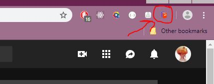]()

<br>

[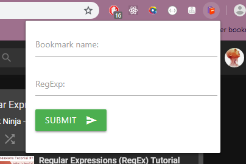]()

Here we need to enter a name of the bookmark we wish to create,
and a regular expression (regExp) based on which our bookmark will be updated. <br />

> Note: Since v2.4.0 regExp is automatically generated / suggested.

But WHAT is a **regular expression**? It simply **is a sequence of characters that define a search pattern**. Ever did CTRL+F to find something on page? Well it's preety much the same thing, but with extra special characters that let your search be more flexible.

Once the form is submited a dynamic bookmark will be created inside `Other bookmarks` folder.

---

## Examples

### **_Tracking videos in a youtube playlist_**

As a demonstration we are going to be using [Regular Expressions Tutorial](https://www.youtube.com/watch?v=r6I-Ahc0HB4&list=PL4cUxeGkcC9g6m_6Sld9Q4jzqdqHd2HiD) by theNetNinja<br />

[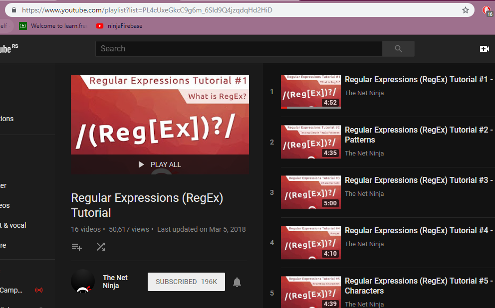]()

<br>

Let's have a closer look at the url of the playlist:
<br>

[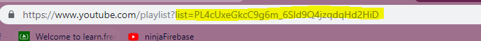]()

The `list=` part of the url is the id of the playlist (it is how youtube knows which playlist we are on). What is so great about this? Well let's try clicking on few videos inside a playlist:

[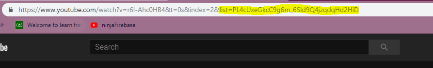]()
[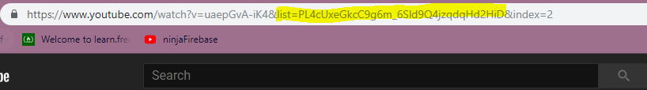]()

Notice how `list=PL4cUxeGkcC9g6m_6Sld9Q4jzqdqHd2HiD` is contained in EVERY video inside a playlist.
Great! That means we can use it.

So what is gonna be our regular expression?

Well it is gonna be `list=PL4cUxeGkcC9g6m_6Sld9Q4jzqdqHd2HiD`, meaning that if a url contains that, then our bookmark will be updated. So let's fill in the form and submit!

[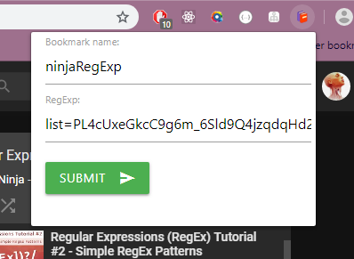]()
[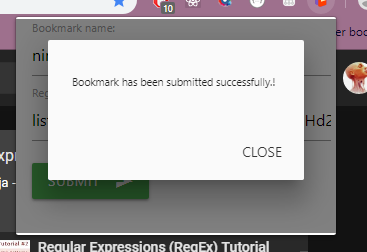]()

Congrats! You have successfully created your first dynamic bookmark!

We can now freely watch netNinja regExp playlist and our bookmark will be automatically updated whenever we click on new video inside that playlist, letting us easily come back later exactly where we left off!

## **_Tracking anime_**

### **Crunchyroll**:

Let's say you wanted to watch Gintama on Crunchyroll. <br>
First let's see what part of the url stays the same. <br> As example let's click a few episodes and see the URL of these episodes:

```
http://www.crunchyroll.com/gintama/episode-182-screw-popularity-votes-534414
http://www.crunchyroll.com/gintama/episode-187-its-goodbye-once-a-flag-is-set-537056
http://www.crunchyroll.com/gintama/episode-186-beware-of-foreshadows-535984
```

So ask yourself, **which part of these urls stays the same?** <br>
Well it is **crunchyroll.com/gintama/** , so we would enter this as our **_regExp_** . <br>
Now every time you clicked on link containing _crunchyroll.com/gintama_ , our bookmark would automatically update to point to that new URL. <br>
But if we were to go to, let's say `http://www.crunchyroll.com/mushi-shi`, then our bookmark would NOT update because _crunchyroll.com/gintama_ is not contained in that link.

### **Kissanime**:

Now what if we wanted to watch Naruto on kissanime? <br>
Again, let's try clicking on few episodes and check the links:

```
https://kissanime.ac/Anime/Naruto-Dub.21820/Episode-186-Laughing-Shino?id=104053
https://kissanime.ac/Anime/Naruto-Dub.21820/Episode-197-Crisis-The-Hidden-Leaf-11-Gather?id=104064
```

Ok so what part stays the same?<br>
It's **_kissanime.ac/Anime/Naruto-Dub.21820_** , so this would be our **_regExp_**

---

## Bookmark manager

So we created our bookmark, but what if we had alot of bookmarks.
How will we know which ones are tracked / dynamic and which ones arent? What if we wanted to untrack? What if we wanted to maybe change our regural expression? Etc.
For these reasons a new extended bookmark manager which focused on these problems had to be made.

There are two ways we can open it:

- by right clicking on bookmark bar then Bookmark manager
- by navigating to `chrome://bookmarks`

[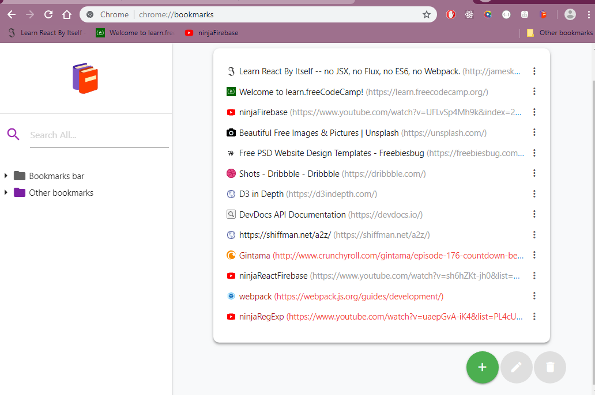]()

Once you open bookmark manager, on the right, all of the bookmark files will be shown. For easier navigation **dynamic bookmarks** are shown in **red color**.

On the left side (sidenav) you can see two main elements.

[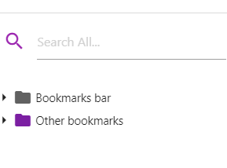]()

So let's take a closer look at each...

---

### Search bar

It might look naive, but this search bar is using regular expressions, allowing you to do ALOT of cool stuff.
Here i will just list a few snippets / examples that you can use

- `https` - lists all https links
- `http[^s]` - all http links (without https)
- `http[s]?://w{3}` - http or https links that start with _www_
- `http[s]?://[^w]` - http/https links that DON'T start with _www_
- `http[s]?://.*?\.com/` - http/https links whose domain name ends with _.com_
- `^n` - all bookmarks with bookmark name starting with letter _n_ (or _N_, by default it is not case sensitive)

> To learn more about regular expression watch [theNetNinja tutorial](https://www.youtube.com/watch?v=r6I-Ahc0HB4&list=PL4cUxeGkcC9g6m_6Sld9Q4jzqdqHd2HiD)

---

### Folder browser

[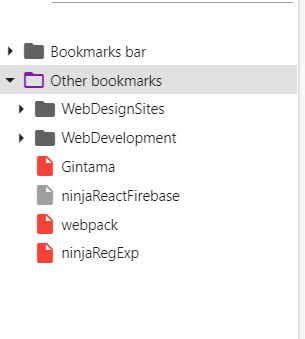]()

This part should be pretty intuitive. It works exactly like Windows Explorer. **By clicking on arrow or double clicking on folder you open/close it**, and if you click once on a folder you will see its content without toggling it, which is all of the bookmarks that are located inside it (no matter how deep, in my case it will also display children of _WebDesignSites_ folder).

To help guide you visually, folders with **purple** color will contain dynamic / tracked bookmarks which are, as we saw previously filled with **red** color.

Clicking on the folder also selects it, which lets you add/edit/delete it as we will see later, same goes for clicking on bookmark.

> note: you can't edit or delete _Bookmark bar_ and _Other bookmarks_ folders because they are special folders created by chrome

---

### Bookmark information

There are two ways to select bookmark:

1. Clicking on it through sidenav
1. By pressing on right most icon from main section

[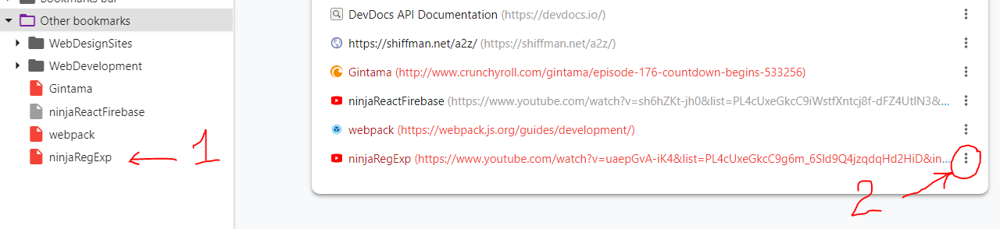]()

Selecting a bookmark will display following:

- _title_ - name of the bookmark
- _url_ - url of page that bookmark is currently pointing to (clickable)
- _parent_ - name of parent folder. (clickable)
- _regExp_ - regular expression (will be hidden if it is not dynamic bookmark)
- _history_ - history of 10 most recent links that bookmark was pointing to (for dynamic bookmarks only)

[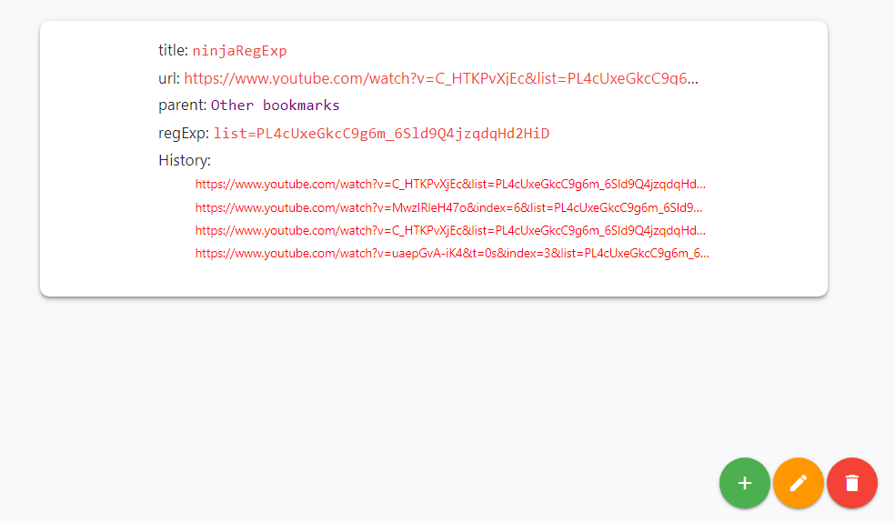]()

---

### Action buttons

You might have noticed that edit and delete buttons have became available once you clicked on a bookmark. Let's have a look at what they do...

#### Delete button

[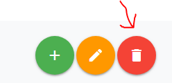]()

This one is most straightforward out of them all. **It deletes currently selected element** wheter if it is folder or bookmark. If you cannot delete a folder (_ex. Other bookmarks and Bookmarks bar_) it will be greyed out and you won't be able to click it.

#### Edit button

[]()

There are two different scenarios upon pressing edit button:

- _Folder is selected_ - it will prompt you with a form to change it's name
- _Bookmark is selected_ - it will prompt you with a form to change name, url or regular expression

> **Deleting regular expression will UNTRACK the bookmark!**

#### Add button

To open this one hover over it.

[]()

Here you are offered with two options:

1. Add folder (topmost icon)
1. Add bookmark

Both will prompt a modal form for you to fill.

> New bookmark/folder will be created inside currently selected directory.

---

### Changing parent folder

There is one more thing left to cover. By now you may be wondering: _How do i move bookmark/folder?_
Well it's super easy. Simply **click on it, and while holding the left mouse button, drag it over to the parent folder and release.** Thats it! :)

> Reminder: You can't move _Other bookmarks_ and _Bookmarks bar_ because they are special chrome folders which can't be changed

---

## What next?

Like i said it would be good to learn regular expressions because knowing it will really let you take full advantage of this extension.

My recommendations are The Coding Train and already mentioned, theNetNinja. You can also use search bar to experiment with regular expressions.

If you have questions which aren't answered in FAQ you can contact me at [Linkedin](https://www.linkedin.com/in/danilo-novakovi%C4%87-821934167/) or by (prefferably) posting an issue on github.
Same goes for if you have an additional idea on how to improve this extension.

---

## FAQ

---

## Support

Reach out to me at one of the following places!

- Website at <a href="https://danilonovakovic.github.io/index.html" target="_blank">`danilonovakovic.github.io`</a>
- Linkedin at <a href="https://www.linkedin.com/in/danilo-novakovi%C4%87-821934167/" target="_blank">`DaniloNovakovic`</a>

---

## License

- **[MIT license](http://opensource.org/licenses/mit-license.php)**
- Copyright 2018 © [DaniloNovakovic](https://github.com/DaniloNovakovic)
