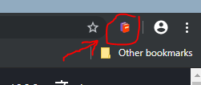

# Chrome Dynamic Bookmarks Extension

> Chrome extension which dynamically updates bookmarks based on the specified regular expression

## Table of Contents

- [Installation](#installation)
- [Usage](#usage)
- [FAQ](#faq)
- [Support](#support)
- [License](#license)

## Getting started

## Installation

Currently this extension is not available on Chrome Web Store, since it is still in developement, but you can install it locally in few steps:

1. [Download](https://github.com/DaniloNovakovic/chrome-dynamic-bookmarks/archive/master.zip) or clone current repository
1. Navigate to downloaded folder and run `npm init` in console (ex. cmd/terminal/powershell)
   (Note: you will need to have [node.js](https://nodejs.org/en/) installed on your computer)
1. Once node_modules is installed run `npm run build` to create production build (or `npm run dev` for development one)
1. On your browser search page type in (navigate to) `chrome://extensions/`
1. In the now opened `chrome://extensions/` page turn on the developer mode
1. Expand the Developer dropodown menu (if needed) and press `Load unpacked` button
1. Navigate to the downloaded/cloned local folder of this repository, select `build` folder and click Ok
1. Assuming there are no errors, the extension should load into your browser

## Usage

Lets start off by clicking on the extension icon on top right.  

 

Here we need to enter a name of the bookmark we wish to create,
and a regular expression based on which our bookmark will be updated  

As a demonstration, pictures below will show you how we can use this extension to keep track of the playlist on youtube, and the one that we are going to be using is [Regular Expressions Tutorial](https://www.youtube.com/watch?v=r6I-Ahc0HB4&list=PL4cUxeGkcC9g6m_6Sld9Q4jzqdqHd2HiD) by theNetNinja 

 

What now? Well what would you do if you wanted to bookmark this page? You would press the star icon  

And the new bookmark would be added pointing to current url with default location of `Other bookmarks` folder.

Same thing is happening here. Once we submit our form a bookmark is gonna be added into `Other bookmarks` folder, except it is gonna be updated whenever we load a new page containing a url matching our regular expression.

But WHAT is a regular expression? Ever looked through page by using CTRL+F? Well regular expression is kinda the same, except it contains special characters which you can find more about by watching playlist that we are already on.
But for now we won't be needing these special characters.

So now that we got that covered, what should our regular expression be?
Well let's have a closer look at the url of the playlist:
 

The `list=` part of the url is the id of the playlist (it is how youtube knows which playlist we are on). What is so great about this? Well let's try clicking on few videos inside a playlist:

Notice how `list=PL4cUxeGkcC9g6m_6Sld9Q4jzqdqHd2HiD` is contained in EVERY video inside a playlist.
Great! That means we can use it.

So what is gonna be our regular expression?

Well it is gonna be `list=PL4cUxeGkcC9g6m_6Sld9Q4jzqdqHd2HiD`, meaning that if a url contains that, then our bookmark will be updated. So let's fill in the form and submit!

Congrats! You have successfully created your first dynamic bookmark!

 

---

## FAQ

---

## Support

Reach out to me at one of the following places!

- Website at <a href="https://danilonovakovic.github.io/index.html" target="_blank">`danilonovakovic.github.io`</a>
- Linkedin at <a href="https://www.linkedin.com/in/danilo-novakovi%C4%87-821934167/" target="_blank">`DaniloNovakovic`</a>

---

## License

- **[MIT license](http://opensource.org/licenses/mit-license.php)**
- Copyright 2018 © [DaniloNovakovic](https://github.com/DaniloNovakovic)
