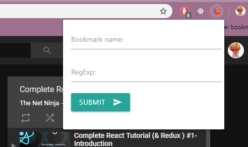

# Chrome Dynamic Bookmarks Extension

> Chrome extension which dynamically updates bookmarks based on the specified regular expression

## Table of Contents

- [Installation](#installation)
- [Usage](#usage)
- [FAQ](#faq)
- [Support](#support)
- [License](#license)

## Getting started

## Installation

Currently this extension is not available on Chrome Web Store, since it is still in developement, but you can install it locally in few steps:

1. [Download](https://github.com/DaniloNovakovic/chrome-dynamic-bookmarks/archive/master.zip) or clone current repository
1. On your browser search page type in (navigate to) `chrome://extensions/`
1. In the now opened `chrome://extensions/` page turn on the developer mode
1. Expand the Developer dropodown menu (if needed) and press `Load unpacked` button
1. Navigate to the downloaded/cloned local folder of this repository and click Ok
1. Assuming there are no errors, the extension should load into your browser

## Usage

Lets start off by clicking on the extension icon on top right.  

 
 
Here we need to enter a name of the bookmark we wish to create,
and a regular expression based on which our bookmark will be updated  
As a demonstration, pictures below will show you how we can use this extension to keep track of the playlist on youtube. 

 

All youtube playlist have query `list=` so lets use this.  
In our regular expression we start off with:
`youtube.com/.*list=PL4cUxeGkcC9ij8CfkAY2RAGb-tmkNwQHG`.  
`.` is a special character meaning any character, and `*` is a quantifier representing zero or more. So our bookmark (named `ninjaReact` in this case) will be updated on any url with `youtube.com/` followed by any chars that eventually end up with `list=PL4cUxeGkcC9ij8CfkAY2RAGb-tmkNwQHG`.

> Note: `*` is "greedy", meaning that it won't stop after it finds right combination, instead it will keep searching for ALL possible combinations. Since we don't really want/need that we can add `?` after it to make it non-greedy and optimize things a bit.

 

After we submit form we should have our bookmark added into _Other bookmarks_, so let's check if it works.

Great! We can see our bookmark and it's link pointing to first video in React and Redux playlist from theNetNinja youtuber.  
Let's try hopping into a different video in that playlist, (for example here i change into video number #16)

Since the new video matches the Regular Expression our bookmark should be automatically updated to point into the new url.  
Let's check if it worked...

Awesome! Our `ninjaReact` bookmark has been updated and now we can always hop back right where we left off!

---

## FAQ

---

## Support

Reach out to me at one of the following places!

- Website at <a href="https://danilonovakovic.github.io/index.html" target="_blank">`danilonovakovic.github.io`</a>
- Linkedin at <a href="https://www.linkedin.com/in/danilo-novakovi%C4%87-821934167/" target="_blank">`DaniloNovakovic`</a>

---

## License

- **[MIT license](http://opensource.org/licenses/mit-license.php)**
- Copyright 2018 © [DaniloNovakovic](https://github.com/DaniloNovakovic)
