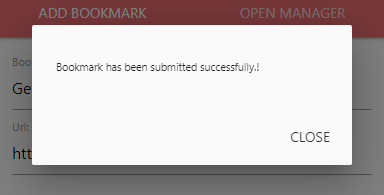
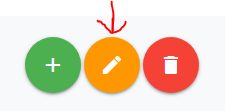
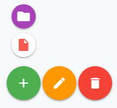

# Chrome Dynamic Bookmarks Extension

Google Chrome extension which dynamically updates bookmarks based on the specified regular expression

## Demo

## Table of Contents

- [Installation](#installation)
- [Introduction](#introduction)
- [Overcoming Custom URL Notation](#overcoming-custom-url-notation)
- [Bookmark manager](#bookmark-manager)
  - [Search bar](#search-bar)
  - [Folder browser](#folder-browser)
  - [Bookmark information](#bookmark-information)
  - [Action buttons](#action-buttons)
    - [Delete](#delete-button)
    - [Edit](#edit-button)
    - [Add](#add-button)
  - [Changing parent folder](#changing-parent-folder)
- [What next?](#what-next)
- [FAQ](#faq)
- [Support](#support)
- [License](#license)

## Getting started

## Installation

### For users (recommended)

1. Click [here](https://chrome.google.com/webstore/detail/dynamic-bookmarks/ilhojkjlfkppedidhpecepohnmlndopb)
1. Select **Add to chrome**
1. Enjoy!

### To install locally (for developers)

1. [Download](https://github.com/DaniloNovakovic/chrome-dynamic-bookmarks/archive/master.zip) or clone current repository
1. Navigate to the downloaded folder and run `npm init` in console (ex. cmd/terminal/PowerShell)
   (Note: you will need to have [node.js](https://nodejs.org/en/) installed on your computer)
1. Once node_modules is installed run `npm run build` to create production build (or `npm run dev` for development one)
1. On your browser search page type in (navigate to) `chrome://extensions/`
1. In the now opened `chrome://extensions/` page turn on the developer mode
1. Expand the Developer dropdown menu (if needed) and press `Load unpacked` button
1. Navigate to the downloaded/cloned local folder of this repository, select `build` folder and click Ok
1. Assuming there are no errors, the extension should load into your browser

## Introduction

Let's start by clicking on the extension icon on the top right.  

Upon clicking a button, form with automatically filled input form will be shown.  

While *Bookmark name*, and *Url* fields are self-explanatory, you might be wondering what does `RegExp` (short for *regular expression*) field represent?

It simply **is a sequence of characters that define a search pattern**. Ever did CTRL+F to find something on the page? Well, it's pretty much the same thing, but with extra special characters that let your search be more flexible.

Once the form is submitted a dynamic bookmark will be created inside `Other bookmarks` folder.

Congrats! You have successfully created your first dynamic bookmark!

---

## Overcoming Custom URL Notation

In most cases, you won't even have to worry about the `RegExp` field since the automatically generated value will be good enough, but you might run into rare occasions where the site will be using unique URL notation which would require manual entry of this field.

An example of such a site is `animekisa.tv`. Let's see how we can generate regular expressions using a very simple tactic.

First, let's **click on few episodes**:

- `https://animekisa.tv/mo-dao-zu-shi-season-2-episode-3`
- `https://animekisa.tv/mo-dao-zu-shi-season-2-episode-4`

Now ask yourself, **what part stays the same?** - `animekisa.tv/mo-dao-zu-shi-season-2`

And that would be our value for the `RegExp` field!

---

## Bookmark manager

So we created our bookmark, but what if we had a lot of bookmarks.
How will we know which ones are tracked / dynamic and which ones aren't? What if we wanted to stop tracking? What if we wanted to maybe change our regular expression? Etc.
For these reasons a new extended bookmark manager which focused on these problems had to be made.

You open it by pressing on the `Open Manager` tab inside a popup window

Once you open the bookmark manager, on the right, all of the bookmark files will be shown. For easier navigation **dynamic bookmarks** are shown in **red color**.

On the left side (side nav) you can see two main elements.

So let's take a closer look at each...

---

### Search bar

It might look naive, but this search bar is using regular expressions, allowing you to do **ALOT** of cool stuff.
Here I will just list a few snippets/examples that you can use

- `https` - lists all https links
- `http[^s]` - all http links (without https)
- `http[s]?://w{3}` - http or https links that start with _www_
- `http[s]?://[^w]` - http/https links that DON'T start with _www_
- `http[s]?://.*?\.com/` - http/https links whose domain name ends with _.com_
- `^n` - all bookmarks with bookmark name starting with letter _n_ (or _N_, by default it is not case sensitive)

> To learn more about regular expression watch [theNetNinja tutorial](https://www.youtube.com/watch?v=r6I-Ahc0HB4&list=PL4cUxeGkcC9g6m_6Sld9Q4jzqdqHd2HiD)

---

### Folder browser

This part should be pretty intuitive. It works exactly like Windows Explorer. **By clicking on arrow or double-clicking on folder you open/close it**, and if you click once on a folder you will see its content without toggling it, which is all of the bookmarks that are located inside it (no matter how deep, in my case it will also display children of _WebDesignSites_ folder).

To help guide you visually, folders with **purple** color will contain dynamic / tracked bookmarks which are, as we saw previously filled with **red** color.

Clicking on the folder also selects it, which lets you add/edit/delete it as we will see later, same goes for clicking on a bookmark.

> note: you can't edit or delete _Bookmark bar_ and _Other bookmarks_ folders because they are special folders created by chrome

---

### Bookmark information

There are two ways to select bookmark:

1. Clicking on it through side nav
1. By pressing on right most icon from the main section

Selecting a bookmark will display the following:

- _title_ - the name of the bookmark
- _url_ - URL of the page that bookmark is currently pointing to (clickable)
- _parent_ - the name of the parent folder. (clickable)
- _regExp_ - regular expression (will be hidden if it is not a dynamic bookmark)
- _history_ - history of 10 most recent links that bookmark was pointing to (for dynamic bookmarks only)

---

### Action buttons

You might have noticed that edit and delete buttons have become available once you clicked on a bookmark. Let's have a look at what they do...

#### Delete button

This one is most straightforward out of them all. **It deletes currently selected element** whether if it is folder or bookmark. If you cannot delete a folder (_ex. Other bookmarks and Bookmarks bar_) it will be greyed out and you won't be able to click it.

#### Edit button

There are two different scenarios upon pressing the edit button:

- _Folder is selected_ - it will prompt you with a form to change its name
- _Bookmark is selected_ - it will prompt you with a form to change name, URL or regular expression

> **Deleting regular expression will UNTRACK the bookmark!**

#### Add button

To open this one hover over it.

Here you are offered two options:

1. Add folder (topmost icon)
1. Add bookmark

Both will prompt a modal form for you to fill.

> New bookmark/folder will be created inside the currently selected directory.

---

### Changing parent folder

There is one more thing left to cover. By now you may be wondering: _How do I move bookmark/folder?_
Well, it's super easy. Simply **click on it, and while holding the left mouse button, drag it over to the parent folder and release.** That's it! :)

> Reminder: You can't move _Other bookmarks_ and _Bookmarks bar_ because they are special chrome folders which can't be changed

---

## What next

It would be good to learn regular expressions because knowing them will let you take full advantage of this extension.

My recommendations are [The Coding Train](https://www.youtube.com/watch?v=7DG3kCDx53c) and [theNetNinja](https://www.youtube.com/watch?v=r6I-Ahc0HB4&list=PL4cUxeGkcC9g6m_6Sld9Q4jzqdqHd2HiD). You can also use the search bar to experiment with regular expressions.

If you have questions that aren't answered in [FAQ](#faq) you can contact me at [Linkedin](https://www.linkedin.com/in/danilo-novakovi%C4%87-821934167/) or by (preferably) posting an issue on GitHub.
The same goes for if you have an additional idea on how to improve this extension.

---

## FAQ

- **What is *regExp*?**
  - `regExp` (short for the regular expression) is a rule upon which it is determined if the URL that you are currently on should be updated.
  - For example, let's say that your `regExp` was `crunchyroll.com/gintama`.
  - If you were on a `http://www.crunchyroll.com/gintama/episode-182-screw-popularity-votes-534414`, then that link would match our `regExp` because `crunchyroll.com/gintama` is contained in this URL, and in turn, our bookmark would be updated.
  - But if you were on, let's say, `https://github.com/DaniloNovakovic/chrome-dynamic-bookmarks`, then it would NOT match our `regExp`, hence our bookmark would not be updated.

---

## Support

Reach out to me at one of the following places!

- Website at <a href="https://danilonovakovic.github.io/index.html" target="_blank">`danilonovakovic.github.io`</a>
- Linkedin at <a href="https://www.linkedin.com/in/danilo-novakovi%C4%87-821934167/" target="_blank">`DaniloNovakovic`</a>

---

## License

- **[MIT license](http://opensource.org/licenses/mit-license.php)**
- Copyright 2018 © [DaniloNovakovic](https://github.com/DaniloNovakovic)
